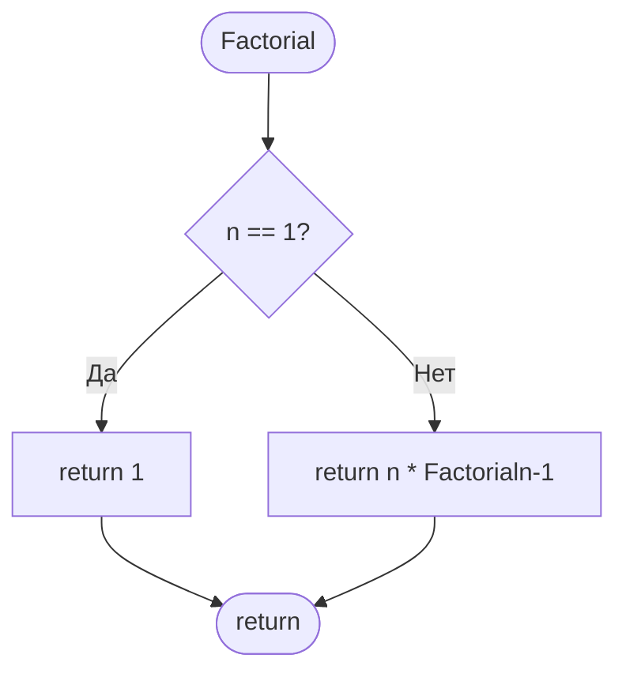
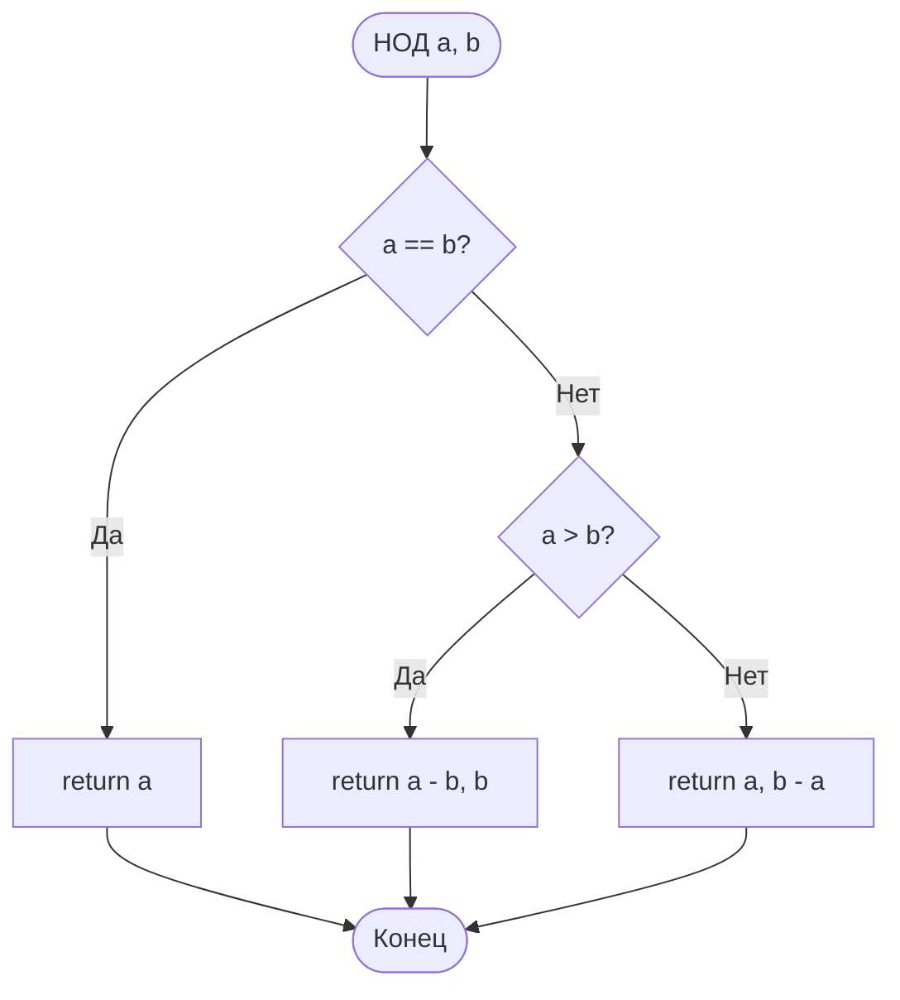
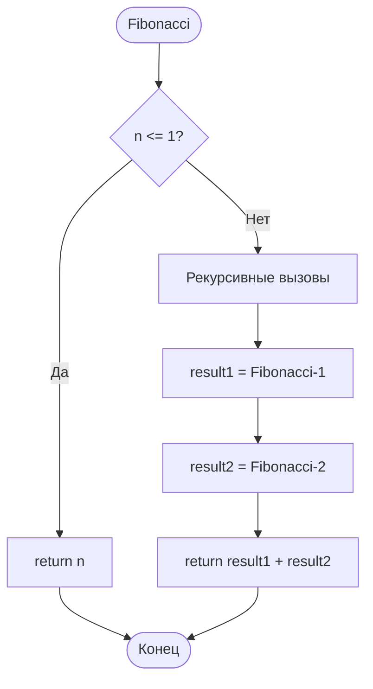

# ***Рекурсия***
<div align="center">
  
</div>

Рекурсия - это такой способ организации вспомогательного алгоритма (подпрограммы), при котором эта подпрограмма (процедура или функция) в ходе выполнения ее операторов обращается сама к себе. То есть в теле функции она вызывает саму себя.

# ***Оглавление***
1. [Факториал](#факториал)
2. [НОД](#нод)
3. [Числа Фибоначчи](#числа-фибоначчи)
4. [Метод половинного деления](#метод-половинного-деления)
5. [Мотивация](#мотивация)
6. [Сумма цифр числа](#сумма-цифр-числа)
7. [Функция](#функция)
8. [Ханойская башня](#ханойская-башня)
9. [Быстрая сортировка](#быстрая-сортировка)
10. [Выводы и итоги работы](#выводы-и-итоги-работы)

## **Факториал**
Факториал — это математическая функция, применяемая к целым неотрицательным числам.

**Простое определение:**

Факториал числа n — это произведение всех натуральных чисел от 1 до этого числа.

Обозначается он восклицательным знаком: n!

Формула:
n! = 1 × 2 × 3 × ... × n

**Примеры:**

3! = 1 × 2 × 3 = 6

5! = 1 × 2 × 3 × 4 × 5 = 120

7! = 1 × 2 × 3 × 4 × 5 × 6 × 7 = 5040

*Блок схема*



*Функция на Go Lang*

```go
func Factorial(n int) int {
	if n == 1 {
		return 1
	} else if n > 1 {
		return Factorial(n-1) * n
	}
	return 1
}
```

*Функция на С++*

```C++
int Factorial(int n)
{
    if (n == 1) 
    {
        return 1;
    }
    else if (n > 1)
    {
        return Factorial(n - 1) * n;
    }
    return 1;
}
```

Вернуться к [Оглавлению](#оглавление)

## **НОД**
НОД — это аббревиатура, которая расшифровывается как Наибольший Общий Делитель.

Простыми словами, НОД двух или более чисел — это самое большое число, на которое все эти числа делятся без остатка.

**Пример:**

Возьмем числа 12 и 18.

Делители числа 12: 1, 2, 3, 4, 6, 12.

Делители числа 18: 1, 2, 3, 6, 9, 18.

Какие делители являются общими для обоих чисел? Это 1, 2, 3, 6.

Наибольший из них — 6.

Значит, НОД(12, 18) = 6.

*Блок схема*



*Функция на Go Lang*

```go
func НОД(a, b int) int {
	if a > b {
		return НОД(a-b, b)
	} else if a < b {
		return НОД(a, b-a)
	}
	return a
}
```

*Функция на C++*

```C++
int НОД(int a, int b)
{
    if (a > b) 
    {
        return НОД(a - b, b);
    }
    else if (a < b)
    {
        return НОД(a, b - a);
    }
    return a;
}
```

Вернуться к [Оглавлению](#оглавление)

## **Числа Фибоначчи**
Числа Фибоначчи — это элементы знаменитой числовой последовательности, в которой каждое последующее число равно сумме двух предыдущих.

Первые 10 чисел последовательности: 1, 1, 2, 3, 5, 8, 13, 21, 34, 55

**Математика:**

* Золотое сечение (φ): Если делить соседние числа Фибоначчи (большее на меньшее), то с ростом номера это отношение стремится к золотому сечению φ ≈ 1.618....

**Природа:**

* Количество лепестков у многих цветов (ирис - 3, лютик - 5, дельфиниум - 8, астра - 21, 34, 55).

* Укладка семян в подсолнухе, шишек в сосновой шишке, ячеек ананаса (располагаются по спиралям, количество которых является числами Фибоначчи).

* Ветвление деревьев, расположение листьев на стебле.

*Блок схема*



*Функция на Go Lang*

```go
func Fibonacci(n int) int {
	if n == 0 {
		return 0
	} else if n == 1 {
		return 1
	} else if n > 1 {
		return Fibonacci(n-1) + Fibonacci(n-2)
	}
	return -1
}
```

*Функция на C++*

```c++
int Fibonacci(int n)
{
    if (n == 0) 
    {
        return 0;
    }
    else if (n == 1)
    {
        return 1;
    }
    else if (n > 1)
    {
        return Fibonacci(n - 1) + Fibonacci(n - 2);
    }
    return -1;
}
```

Вернуться к [Оглавлению](#оглавление)

## **Метод половинного деления**
Метод половинного деления (или метод бисекции) — это простой и надежный численный метод для нахождения приближенного корня уравнения с заданной точностью.

Проще говоря, если у нас есть уравнение вида f(x) = 0 и мы знаем, что на некотором отрезке [a, b] корень существует, то метод половинного деления позволяет последовательно сужать этот отрезок, пока его длина не станет меньше требуемой погрешности.

**Основная идея:**

1. Мы находим отрезок [a, b], на концах которого функция принимает значения разных знаков (т.е. f(a) * f(b) < 0). Из теоремы Больцано-Коши следует, что если функция непрерывна на этом отрезке, то на нем существует хотя бы один корень.

2. Мы делим этот отрезок пополам, находя середину c = (a + b) / 2.

3. Смотрим, в какой половине находится корень:

   * Если f(a) и f(c) имеют разные знаки, значит, корень лежит между a и c. Тогда мы принимаем c за новую правую границу (b = c).

   * Если f(c) и f(b) имеют разные знаки, значит, корень лежит между c и b. Тогда мы принимаем c за новую левую границу (a = c).

4. Процесс повторяется до тех пор, пока длина отрезка [a, b] не станет меньше заранее заданной точности ε.

$f(x) = \arccos(x) - \sqrt{1 - 0,3x^3}$ — её и будем иследовать.

*Функция на Go Lang*
```go
func f(x float64) float64 {
	return math.Acos(x) - math.Sqrt(1-0.3*math.Pow(x, 3))
}

func Bisection(a, b, epsilon float64) float64 {
	if math.Abs(b-a) < epsilon {
		return (a + b) / 2
	}

	c := (a + b) / 2
	fc := f(c)

	if fc == 0 {
		return c
	}

	if f(a)*fc < 0 {
		return Bisection(a, c, epsilon)
	} else {
		return Bisection(c, b, epsilon)
	}
}
```

*Функция на С++*

```C++
double f(double x)
{
    return  acos(x) - sqrt(1 - 0.3 * pow(x, 3));
}

double Bisection(double a, double b, double epsilon)
{
    if (abs(b - a) < epsilon)
    {
        return (a + b) / 2;
    }

    double c = (a + b) / 2;
    double fc = f(c);

    if (fc == 0)
    {
        return c;
    }

    if (f(a) * fc < 0)
    {
        return Bisection(a, c, epsilon);
    }
    else
    {
        return Bisection(c, b, epsilon);
    }
}
```

Вернуться к [Оглавлению](#оглавление)

## **Мотивация**
<div align="center">
  
</div>

**Молодец. Ты дошел до мотивации! Теперь пора бы немного расслабиться. Осталось совсем чуть-чуть. Почувствуй, как ты прокачал свой мозг! А пока передохни немного и посмотри на этого милого котика. Ты проделал большую работу.**

Вернуться к [Оглавлению](#оглавление)

## **Сумма цифр числа**
Сумма цифр числа — это результат сложения всех отдельных цифр, из которых состоит это число.

Проще говоря, вы берете число, разбираете его на отдельные цифры и эти цифры складываете.

**Пример:**

Число: 123

Цифры: 1, 2 и 3

Сумма цифр: 1 + 2 + 3 = 6

**Для чего нужно: (Применение)**

> Признаки делимости. Например, знаменитый признак делимости на 3.  Число делится на 3 тогда и только тогда, когда сумма его цифр делится на 3. Тоже самое и с 9.

> Криптография и контрольные суммы. В сложных алгоритмах шифрования и проверки целостности данных (например, в номерах банковских карт) используются модифицированные операции с суммой цифр.

*Функция на Go Lang*

```go
func Sum(n int) int {
	if n < 10 {
		return n
	}
	return n%10 + Sum(n/10)
}
```

*Функция на С++*

```C++
int Sum(int n)
{
    if (n < 10)
    {
        return n;
    }
    return n % 10 + Sum(n / 10);
}
```

Вернуться к [Оглавлению](#оглавление)

## **Функция**
<div align="center">
  
</div>

Это рекурсивная функция, известная как последовательность Штерна-Броко (Stern–Brocot sequence) или диатомическая последовательность.

1. Функция симметрична: F(n) = F(n+1) для многих значений, создавая "горный ландшафт"

2. Эта последовательность генерирует все несократимые дроби: F(n)/F(n+1) даёт все рациональные числа между 0 и 1

3. Максимальные значения в последовательности растут подобно числам Фибоначчи

*Функция на Go Lang*

```go
func f(n int) int {
	if n == 1 {
		return 1
	} else if n%2 == 0 {
		return f(n/2)
	} else {
		return f(n/2) + f(n/2+1)
	}
}
```

*Функция на C++*

```c++
int f(int n)
{
    if (n == 1)
    {
        return 1;
    }
    else if (n % 2 == 0) 
    {
        return f(n / 2);
    }
    else 
    {
        return f(n / 2) + f(n / 2 + 1);
    }
}
```

Вернуться к [Оглавлению](#оглавление)

## **Ханойская башня**
Ханойская башня — это головоломка, где нужно перенести башню из дисков разного размера с одного стержня на другой, соблюдая правила:

1. Перемещать по одному диску за раз

2. Брать только верхний диск

3. Не класть большой диск на маленький

**Особенности:**

* Классический пример рекурсии в программировании

* Минимальное число ходов: 2ⁿ - 1 для n дисков

* Согласно легенде, монахи перемещают 64 диска — когда закончат, наступит конец света (это займет ~585 млрд лет)

**Суть:** чтобы переместить n дисков, нужно сначала переместить (n - 1) дисков на вспомогательный стержень, потом самый большой диск, и затем (n - 1) дисков на конечный стержень.

*Функция на Go Lang*

```go
func Hanoi(n int, A, C, B string) {
	if n == 1 {
		fmt.Printf("Переместить диск 1 с %s на %s\n", A, C)
		return
	}

	Hanoi(n-1, A, B, C)
	fmt.Printf("Переместить диск %d с %s на %s\n", n, A, C)
	Hanoi(n-1, B, C, A)
}
```

*Функция на С++*

```c++
void Hanoi(int n, char A, char B, char C) {
    if (n == 1) 
    {
        cout << "Переместить диск 1 с " << A << " на " << C << "\n";
        return;
    }
    
    Hanoi(n - 1, A, B, C);
    cout << "Переместить диск " << n << " с " << A << " на " << B << endl;
    Hanoi(n - 1, B, C, A);
}
```

Вернуться к [Оглавлению](#оглавление)

## **Быстрая сортировка**
Быстрая сортировка — это эффективный алгоритм сортировки, работающий по принципу "разделяй и властвуй". Он был разработан Тони Хоаром в 1960 году и является одним из самых быстрых алгоритмов сортировки на практике.

Алгоритм основан на стратегии:

> Выбери опорный элемент (pivot) из массива

> Раздели массив так, чтобы все элементы меньше опорного оказались слева, а все элементы больше — справа

> Рекурсивно примени этот же процесс к левой и правой частям

*Функция на Go Lang*

```go
func Fast(arr []int) {
	fmt.Println("\n---Быстрая сортировка---")

	size := len(arr)

	var sort func(int, int)

	sort = func(low, high int) {

		if low < high {
			per := arr[high]
			i := low - 1

			for j := low; j < high; j++ {
				if arr[j] <= per {
					i++
					arr[i], arr[j] = arr[j], arr[i]
				}
			}

			arr[i+1], arr[high] = arr[high], arr[i+1]
			perIndex := i + 1
			sort(low, perIndex-1)
			sort(perIndex+1, high)
		}
	}

	sort(0, size-1)

	fmt.Println("Отсортированный массив:", arr)
}
```

*Функция на C++*

```c++
void Fast(vector<int>& arr) {
    cout << "\n---Быстрая сортировка---\n";

    int size = arr.size();

    function<void(int, int)> sort;

    sort = [&](int low, int high) 
    {
        if (low < high) 
        {
            int per = arr[high];  
            int i = low - 1;

            for (int j = low; j < high; j++) 
            {
                if (arr[j] <= per) 
                {
                    i++;
                    swap(arr[i], arr[j]);
                }
            }

            swap(arr[i + 1], arr[high]);
            int perIndex = i + 1;
            
            sort(low, perIndex - 1);
            sort(perIndex + 1, high);
        }
    };

    sort(0, size - 1);

    cout << "Отсортированный массив: ";
    for (int num : arr) 
    {
        cout << num << " ";
    }
}
````

Вернуться к [Оглавлению](#оглавление)

## **Выводы и итоги работы**
Основные достижения

> Освоение рекурсивного мышления. Успешно реализованы различные алгоритмы, использующие рекурсию

> Понимание принципа "разделяй и властвуй" в решении задач

> Навык декомпозиции сложных проблем на более простые подзадачи

Сравнительный анализ языков программирования

1. Go: простая читаемость, встроенная поддержка параллелизма

2. C++: высокая производительность, богатая стандартная библиотека

**Математические алгоритмы:**

✅ Факториал - понимание рекуррентных соотношений

✅ НОД - работа с алгоритмом Евклида

✅ Числа Фибоначчи - классический пример двойной рекурсии

✅ Метод бисекции - применение в численных методах

**Практические приложения:**

✅ Сумма цифр - обработка числовых данных

✅ Ханойская башня - визуализация рекурсивного процесса

✅ Быстрая сортировка - эффективная работа с массивами

 ***Заключение***

Работа демонстрирует успешное освоение фундаментальной концепции компьютерных наук - рекурсии. Полученные знания и навыки составляют прочную основу для дальнейшего профессионального роста в области алгоритмов и структур данных.

Рекурсия - это не просто технический приём, а способ мышления, позволяющий элегантно решать сложные проблемы через их последовательное упрощение.

Вернуться к [Оглавлению](#оглавление)

***Спасибо, что уделили своё время на прочтение и изучение данного проекта на тему: "Рекурсия".***

<div align="center">
  
</div>

---

<div align="center"> Made with ❤️ by <b>l1m3ow</b> </div>
